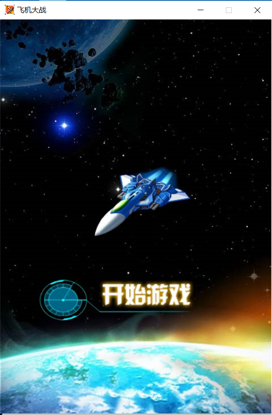
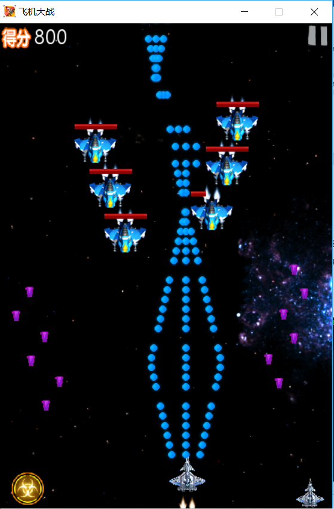
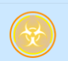
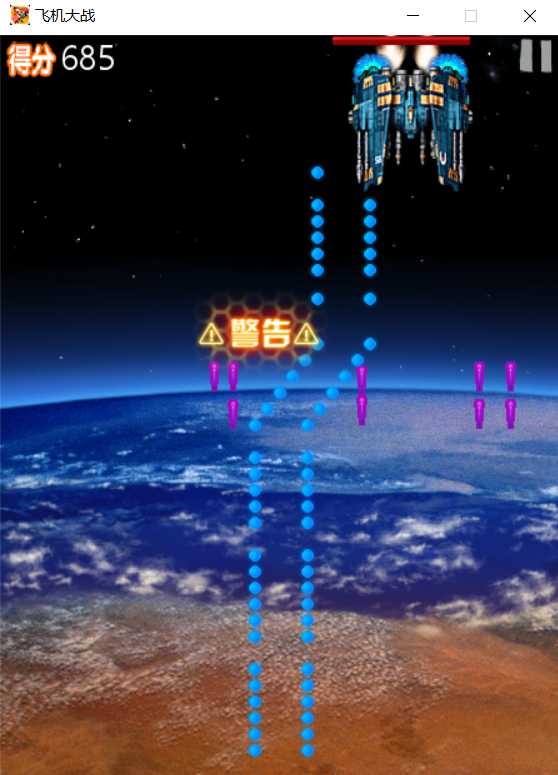
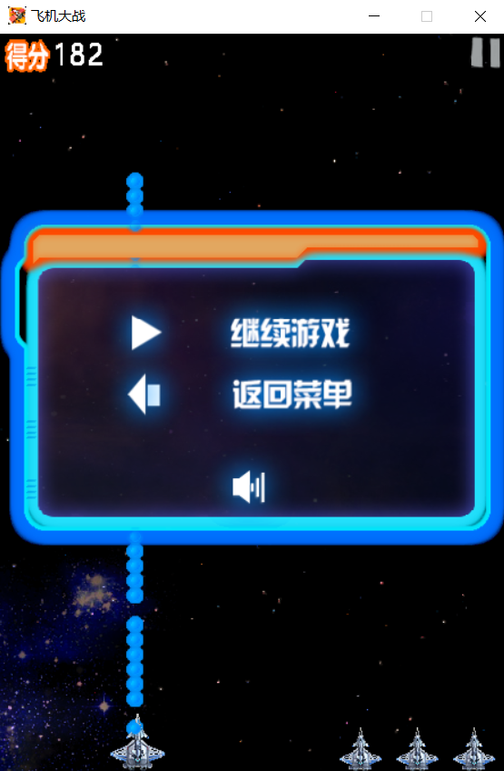
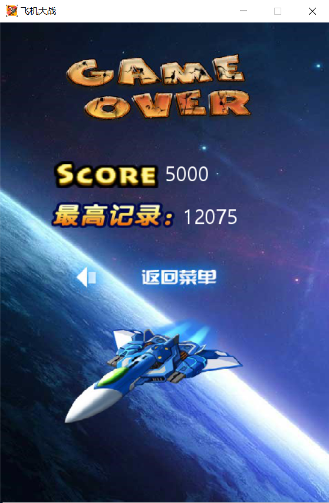

## 飞机大战1.0
- author:许清源
- 学号：16041187
- date: 2018/9/7

### 运行条件
* 开发环境：python3.6, pygame, win10，pycharm
* 依赖库：pygame，  
    - pip install pygame
    - 进入终端执行python main.py 开始游戏
    - 右上角x退出游戏

### 游戏简介
通过键盘控制方向，通过吃地图产生的能量进行升级子弹，或血进行回血，开始时有3条命，每次复活有1s无敌时间，space可请全屏。

### 操作方法
- 控制方向：
    - W & UP : 向上移动
    - S & DOWN : 向下移动
    - A & LEFT : 向左移动
    - D & RIGHT: 向右移动

- 清屏大招：space  
- 每次游戏有3条生命，被击中或者与敌机相撞损失1条生命  
- 每次复活有1秒无敌时间 (机体闪烁结束，则无敌时间结束)  
- 右上角暂停，可关闭/开启声音，可返回主菜单
- 通过吃资源升级子弹，目前最高只有5种，可吃资源回血

### 游戏内容
#### 开始页面  
* 点击开始游戏，

#### 游戏页面

* 目前有5种子弹  

* 2种资源：  
    * 可用于升级子弹  
    
    * 可用于回血  
    
    * 大招（清全屏） space  
    

* 5种敌机  
    * boss  
    

#### 游戏暂停页面
* 可关闭声音， 继续游戏或者返回菜单  

#### 游戏结束页面
* 当前分数和最高分，返回菜单

    
### 参考：
https://github.com/youngxhui/PlaneWars  